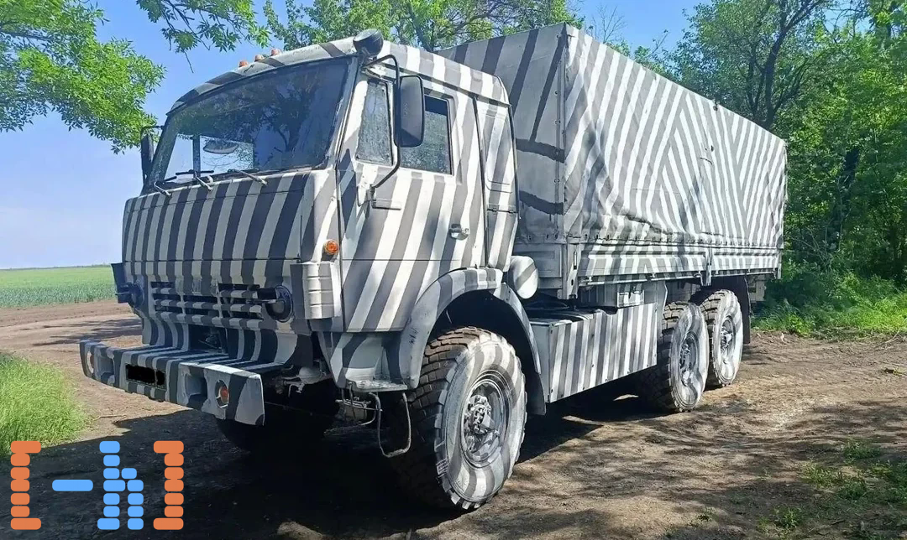

فرض کنید به عنوان مسئول استتار کامیون مهمات لجیستیک میاید و کامیون رو به شکل راه راه رنگ میزنید تا از دست پهپاد های اوکراینی در امان بمونید. اما چرا اینکار رو میکنید؟
### لینک خبر:
> [RFE/RL – Zebra Trucks: Why Russia Is Using 'Dazzle Camouflage' In Ukraine](https://www.rferl.org/a/zebra-dazzle-camouflage-ai-hornet-drones-russia-ukraine-invasion/33771856.html)

در جنگ های `Modern Warfare` امروزی AI نقش چشم گیری رو ایفا میکنه و به دنبال اون توانایی مقابله با سلاح های به اصطلاح `AI-Integrated` بیش از پیش اهمیت پیدا کرده. برای اینکه ببینیم که چطوری این خطوط موازی به استتار این کامیون روس کمک میکنن باید اول به چند تا کانسپت `Computer Vision` یا بینایی ماشین سر بزنیم.

## درک AI از کامیون

باید در نظر داشته باشیم که مدلی که داریم ازش استفاده میکنیم "کامیون" رو اون طوری که ما میبینیم نمیبینه! بلکه هنگام آموزش، الگوهای آماری و ویژگی‌های مشترک بین صدها هزار تصویر کامیون را یاد می‌گیره، پس با دیدن ترکیبی از ویژگی ها (`Features`) آشنا در یک تصویر تصمیم میگیره که یک کامیون دیده.

در شبکه عصبی `CNN` که در یادگیری Feature های تصویر به کار میرن لایه های ابتدایی ویژگی های ساده تر مثل لبه ها (`Edges`) و بافت (`Texture`) رو استخراج میکنند و لایه های بعدی نیز گوشه ها، خم ها و شکل های ساده و به مرور با ترکیب ویژگی های لایه های قبلی، الگو های پیچیده تر مثل چرخ ها و در نهایت خود کامیون تجسم میشه. 


## استتار راه‌راه !

بیاید از سطح تا عمق رو بررسی کنیم که در استنباط مدل از کامیون استتار شده چه چیزی رخ میده:

1. در گام اول کشیدن طرح راه راه روی کامیون باعث ایجاد لبه ها و مرز های اضافه میشه: 

```
# Before
████████████
████████████
████████████

# After
█░█░█░█░█░█
░█░█░█░█░█░
█░█░█░█░█░█
```


 طرح راه راه دارای `Contrast` (اختلاف روشنایی) بالایی هست و به اصطلاحِ کامپیوتر ویژنی ها تغییرات فرکانس-بالا به حساب میاد. از اونجایی که `CNN` از تغییرات یهویی در سطح روشنایی پیکسل های مجاور متوجه میشه وارد ناحیه جدید شده و اونجا رو لبه تشخیص میده، کشیدن این خطوط حسابی برای مدل دردسر درست میکنه.
 
<br>

2. مشکل بعدی بافت کامیون هست که دسخوش تغییر شده و طبق تحقیقات مدل های `CNN` بیشتر ازون که به شکل کلی اشیا تکیه کنن، به بافت (`Texture`) آن‌ها وابستن (به اصطلاح `texture-biased`) و اگر بافت تغییر کنه پیش بینی مدل هم تغییر میکنه. (در یکی از مقاله هایی که ضمیمه شده `texture` پوست فیل رو روی گربه گذاشتن و مدل 63% احتمال داده که موجود داخل تصویر فیله! البته اینجا قرار نیست مدل بگه کامیونه گورخره ولی خب ایده رو گرفتید XD)

<br>

3.  علاوه بر این، خطوط راه راه باعث میشن که مرز واقعی کامیون با مرز ایجاد شده توسط رنگ آمیزی قاطی بشه و در نتیجه سایه‌نما (`Silhouette`) یا همون شکل کلی کامیون نسبت به پس زمینه کمتر قابل تشخیص باشه.
<br>

```
# Before
..............
.....██████... 
....████████..
....████████..
.....██████...
..............

# After
..............
....█░█░██░...
...░█░██░█....
...█░██░█░....
....░█░██.....
..............
```

### در نتیجه:
مجموع این تغییرات باعث میشن که تصویری که مدل میبیند دیگه شباهت زیادی به توزیع داده‌هایی که هنگام آموزش دیده نداشته باشد. اتفاقی که در یادگیری ماشین بهش `Distribution Shift` میگن.

در نتیجه ویژگی های استخراج شده از کامیون ممکن است از `Feature Space` مربوط به کامیون معمولی فاصله بگیرن و مدل با اطمینان کمتری (`Confidence Score` پایین تر) آنرا به عنوان کامیون درنظر بگیرد.

## واقعیت میدانی

واقعیت اینجاست که در محیط آزمایشگاهی ممکنه تغییری در تصمیم گیری پهپاد ایجاد نکنه. ولی در واقعیت و حین ماموریت پهپاد زنجیره ای از فاکتور ها دست به دست هم میدن که به استتار معنا میبخشه: 
- کامیون تنها چند پیکسل از تصویری که پهپاد در آسمان از زمین میگیره رو اشغال میکنه و resolution پایینه
- لرزش های در حین حرکت پهپاد تصویر رو تار میکنه (Motion Blur)
- شرایط آب و هوایی سخت! که ممکنه پیش بیاد.
و در نهایت کامیونی که از دید مدل هوش مصنوعی استتار کرده باعث میشه مدل Confidence Score پایینی داشته باشه و در تصمیم گیری که آیا دشمن رو دیده یا خیر ناتوان بشه.
<br>
پس  به طور واقع بینانه قرار نیست پهپاد کامیون شما رو گورخر ببینه! بلکه دقتش پایین میاد و ممکنه هدف رو miss کنه.
<br>
<br>
<br>

### مقالات و رفرنس ها

>- [ImageNet-trained CNNs are biased towards texture; increasing shape bias improves accuracy and robustness](https://arxiv.org/abs/1811.12231)
> 
> - [A Survey of Camouflaged Object Detection and Beyond](https://arxiv.org/abs/2408.14562)
> 
> - [Camouflaged Object Detection and Tracking: A Survey](https://arxiv.org/abs/2012.13581)
> 
> - [Hourglass Vision Transformers for Camouflaged Object Detection (IEEE)](https://www.computer.org/publications/tech-news/trends/hourglass-vision-transformers/)
> 
> - [Computer Vision: Algorithms and Applications (Richard Szeliski)](https://szeliski.org/Book/)
> 
> - [Deep Learning Book (Goodfellow, Bengio, Courville)](https://www.deeplearningbook.org/)

