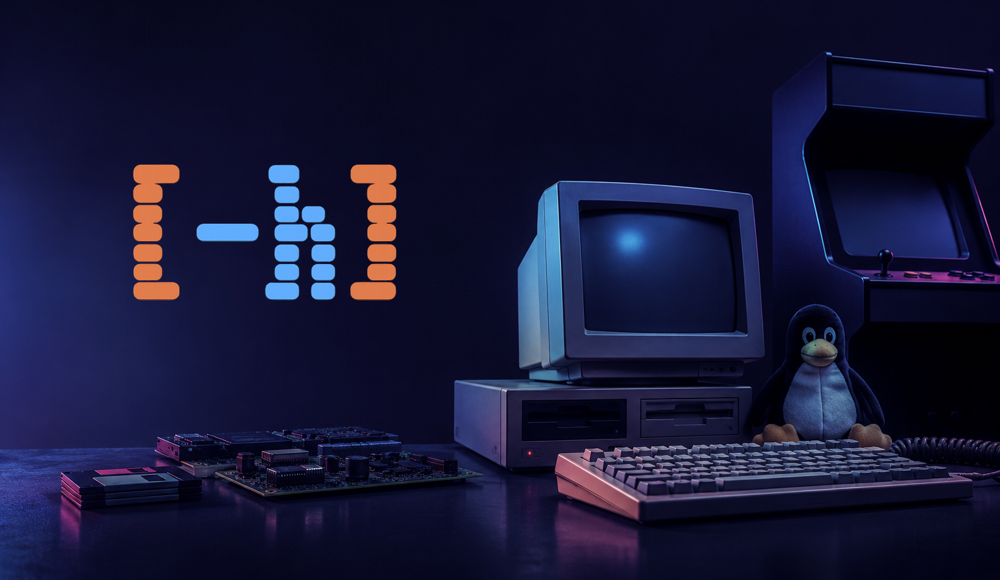
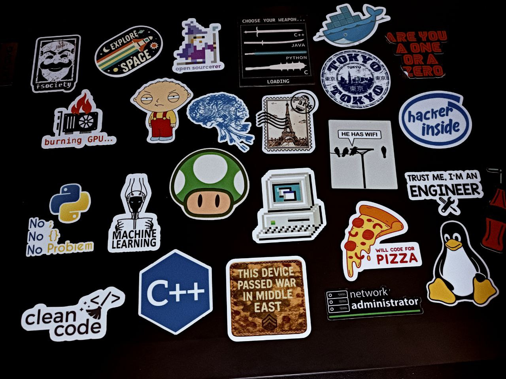

Well first things first i'm so happy to announce my first blog post website, It's been a so long time since I wanted to have one! since there is so many cool stuff i face in this `Computer Science` journey of mine i thought that it should be cool to document some online.

```bash
> Computers -h  # computers human readable
```

## Computer Science Journey of Mine 

Throughout this blog, you'll find deep dives into the projects and concepts that define my CS journey. From `Machine Learning` and `Computer Vision` to `Operating Systems` and `Cryptography`.

Whether it's building a FastAPI wrapper around a cutting-edge object counting model or implementing regex-to-DFA converters, each post will break down the _why_ behind the technical choices and the lessons learned along the way.

## FOSS Family and The lovely Penguin 

It has been almost 3 to 4 years since I became familiar with `Free & Open Source Software` and the liberation philosophy in the computing world; especially the `GNU/Linux` operating system, which was a deep dive into an ocean I have yet to fully explore! (Heads up: expect lots of Linux content!)


## CS-Astronaut & Astro-Terminal 

There's something cosmic about the pull toward both the stars and the code. I've always felt that wonder when gazing up at the night sky. It's a feeling I carry into everything I do, which is why I chose **CS-Astronaut** as my identity on GitHub and **Astro-Terminal** as my gathering space on Telegram. The universe and the terminal, somehow, speak the same language.


> summer of 2026



