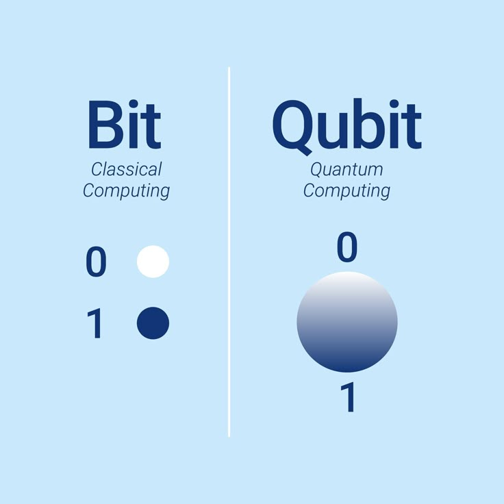
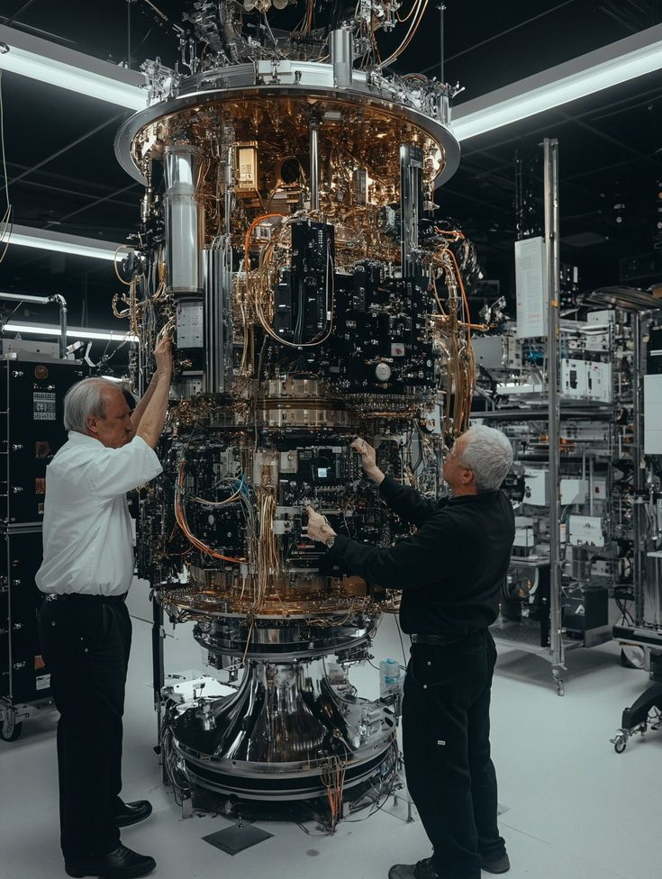

## کامپیوترهای کوانتومی

کامپیوترهای کوانتومی که حاصل همکاری فیزیک، ریاضیات و علوم کامپیوتر هستند، تنها امید انسان برای آینده‌ای بسیار متفاوت‌اند. اما برای درک بهتر این شگفتی باید اول به پایه‌های سازنده‌ی این ابرمحاسبه‌گرها، یعنی **کیوبیت (Qubit)** نگاه کنیم.

---
## بیت و کیوبیت

کیوبیت تقریباً مفهوم متناظری با بیت در کامپیوتر‌های کلاسیک دارد. بیت‌ها در واقع ترانزیستور‌های بسیار کوچکی هستند که در آن‌ها مقدار مشخصی از جریان الکتریکی جاری است و به مقدار مشخصی از آن، ۰ و به مقدار دیگری ۱ نسبت می‌دهیم. این ساختار به کمک علم برق و از طریق گیت‌های منطقی، مفاهیم ریاضی مانند + و × را بازسازی می‌کنند.
به طور ساده، هر بیت مانند جعبه‌ای است که درون آن یا مقدار ۰ و یا ۱ قرار دارد. یک سکه روی میز را تصور کنید. آن سکه فقط می‌تواند یکی از دو حالت مشخص (پشت و رو) را نشان دهد.

اما مسئله در کیوبیت‌ها متفاوت است. کیوبیت‌ها در واقع بازتاب‌دهنده‌ی مفاهیم خاصی در فیزیک کوانتوم مانند **برهم‌نهی** یا **درهم‌تنیدگی** هستند. برای درک این مسائل نیازی نیست حتماً فیزیک کوانتوم را کاملاً بلد باشیم، اما باید بدانیم این مفاهیم دقیقاً چطور کار می‌کنند.

کیوبیت مانند بیت سعی در استفاده از صفر و یک دارد، اما برخلاف بیت، مقدار معمولاً مشخصی ندارد. ما فهمیدیم که بیت (به کمک الکتریسیته) همیشه حامل یک مقدار مشخص است، صفر یا یک. اما کیوبیت می‌تواند هم ۰ باشد و هم ۱، در آن واحد. کیوبیت را از منظر ریاضی به شکل یک کره به نام **کره‌ی بلوخ** نشان می‌دهند. قطب شمالی این کره ۰ و قطب جنوبی آن ۱ را نشان می‌دهد و بقیه‌ی نقاط کره اشاره به ترکیبی از این دو مقدار دارد. برای درک بهتر به مثال سکه برمی‌گردیم؛ فرض کنید سکه را روی میز می‌چرخانید. سکه‌ی در حال چرخش، بر خلاف سکه‌ی خوابیده روی میز، هم می‌تواند ۰ باشد و هم ۱.

شاید در نگاه اول به نظر ساده برسد، اما کمی دقیق‌تر که نگاه کنیم، از لحاظ منطقی این سؤال پیش می‌آید چطور چیزی بسازیم که حاوی دو مقدار اطلاعات باشد؟
واقعیت این است که این سؤال در حوزه‌ی منطق جوابی ندارد؛ باید برای درکش به مفهوم برهم‌نهی یا سوپرپوزیشن (superposition) در فیزیک کوانتوم نگاه کنیم.

## برهم‌نهی

در فیزیک کوانتوم، مفهوم برهم‌نهی یعنی یک واحد کوانتومی مانند الکترون، همزمان حامل دو شرایط مختلف باشد تا زمانی که آن را اندازه‌گیری کنید! مثلاً الکترون همزمان هم به چپ و هم به راست می‌چرخد (دقت کنید که به این معنا نیست که یک لحظه به چپ و لحظه‌ی دیگری به راست بچرخد، بلکه هر دوی این‌ها همزمان وجود دارند و این مسئله به‌خاطر ناآگاهی انسانی از سمت چرخش آن نیست، بلکه فرم ذاتیه‌ی این ساختار است). در این حالت می‌گوییم الکترون در حالت سوپرپوزیشن یا برهم‌نهی قرار دارد.

به همین ترتیب کیوبیت‌ها را با روش‌های متنوعی پیاده‌سازی می‌کنند، اما پیاده‌سازی مفهوم برهم‌نهی را از خود فیزیک کوانتوم به ارث می‌برند.

اما قدرت بی‌نظیر این ابرمحاسبه‌گرها وابسته به مفهوم دیگری به نام درهم‌تنیدگی است.

## درهم‌تنیدگی

در فیزیک کوانتوم، دو واحد کوانتومی مانند دو الکترون می‌توانند درهم‌تنیده بشوند. یعنی چی؟ یعنی مشخص شدن وضعیت یکی، وضعیت دیگری را در آن واحد مشخص می‌کند بدون اینکه آن را اندازه‌گیری کنیم. حتی اهمیتی ندارد که یکی از آنها در سمت دیگر کیهان باشد، یا دسترسی به آن داشته باشیم یا نه؛ بلکه کافی است یکی را اندازه‌گیری کنیم و دیگری خودبه‌خود وضعیتش مشخص می‌شود. انگار که نخی نامرئی بین این دو الکترون وجود دارد.
این خاصیت قدرت بسیار زیادی برای محاسبات به کامپیوتر‌های کوانتومی می‌دهد.

مثلاً شما می‌توانید با سه کیوبیت، ۸ حالت مختلف را همزمان بررسی کنید (۰۰۰ تا ۱۱۱). تازه اگر آن را به ۵۰ کیوبیت افزایش دهید، تعداد حالات از اتم‌های جهان هم بیشتر می‌شود!

---
## چالش‌ها

در دنیای کیوبیت‌ها چالش‌های بسیاری وجود دارد. مثلاً پایدار کردن کیوبیت‌ها خیلی سخت و هزینه‌بر است. آن‌ها بسیار به گرما و صدا حساس هستند و باید در محفظه‌های مخصوص تا دمای نزدیک به صفر مطلق سرد شوند تا دچار واپاشی و خطا نشوند و همچنان هنوز نمی‌توانیم کیوبیت‌ها را به تعداد زیاد (مثلاً ۱۰۰۰ تا) پایدار نگه داریم.

*grep-FOX*
